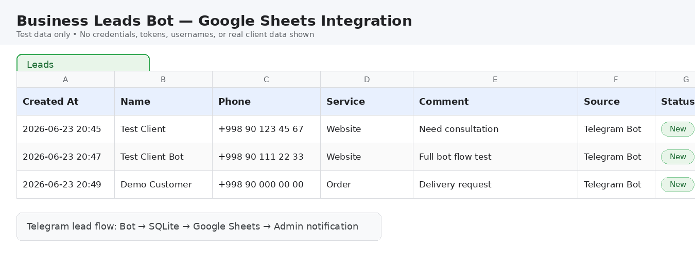

# Business Leads Telegram Bot

Telegram-бот для приема заявок от клиентов с сохранением в SQLite, уведомлением администратора и дополнительной интеграцией с Google Sheets.

Проект подходит для кафе, учебных центров, клиник, магазинов, служб доставки и сервисных компаний.

## Business problem

Малый бизнес часто принимает заявки вручную: через Telegram, звонки или сообщения менеджеру. Из-за этого заявки легко потерять, сложно контролировать историю обращений и неудобно передавать данные в таблицу или CRM.

## Solution

Этот бот автоматизирует прием заявок:

1. Клиент оставляет заявку в Telegram.
2. Бот сохраняет заявку в локальную SQLite базу.
3. Бот дополнительно отправляет заявку в Google Sheets.
4. Администратор получает уведомление в Telegram.

SQLite остается основным локальным хранилищем. Google Sheets используется как дополнительная интеграция для менеджера или владельца бизнеса.

## Features

* Принимает заявку через Telegram
* Спрашивает имя клиента
* Спрашивает номер телефона
* Позволяет выбрать услугу или товар
* Принимает комментарий
* Сохраняет заявку в SQLite
* Дополнительно сохраняет заявку в Google Sheets
* Отправляет уведомление администратору в Telegram
* Продолжает работать, если Google Sheets временно недоступен
* Использует `.env` для безопасной конфигурации
* Защищает секреты через `.gitignore`

## Screenshots

### Client flow


### Admin notification


### Google Sheets integration



## Tech stack

* Python
* aiogram
* SQLite
* python-dotenv
* gspread
* google-auth
* Google Sheets API
* Telegram Bot API

## How it works

Клиент нажимает `/start`.

Бот задает вопросы:

1. Имя
2. Телефон
3. Услуга / товар
4. Комментарий

После этого бот:

1. сохраняет заявку в SQLite;
2. пробует добавить заявку в Google Sheets;
3. отправляет уведомление администратору в Telegram;
4. отправляет клиенту сообщение об успешной заявке.

Если Google Sheets временно недоступен, бот не падает и не теряет заявку, потому что SQLite сохраняет данные первым.

## Installation

Создать виртуальное окружение:

```powershell
python -m venv .venv
```

Активировать окружение:

```powershell
.venv\Scripts\activate
```

Установить зависимости:

```powershell
pip install -r requirements.txt
```

Создать локальный `.env` файл на основе `.env.example`.

## Environment variables

Пример `.env.example`:

```env
BOT_TOKEN=your_bot_token_here
ADMIN_ID=your_telegram_admin_id_here
DATABASE_PATH=leads.db

GOOGLE_SHEETS_ENABLED=false
GOOGLE_SHEET_ID=your_google_sheet_id_here
GOOGLE_CREDENTIALS_FILE=credentials/google-service-account.json
```

В локальном `.env` нужно указать реальные значения. Файл `.env` нельзя публиковать в GitHub.

## Google Sheets integration

Бот может дополнительно сохранять каждую заявку в Google Sheets.

Чтобы подключить Google Sheets:

1. Создать Google Cloud Project.
2. Включить Google Sheets API.
3. Создать Service Account.
4. Скачать JSON key.
5. Положить JSON key локально:

```text
credentials/google-service-account.json
```

6. Открыть Google Sheet.
7. Нажать **Share / Поделиться**.
8. Добавить `client_email` из service account JSON.
9. Дать доступ **Editor / Редактор**.
10. В локальном `.env` указать:

```env
GOOGLE_SHEETS_ENABLED=true
GOOGLE_SHEET_ID=your_real_google_sheet_id_here
GOOGLE_CREDENTIALS_FILE=credentials/google-service-account.json
```

Важно: `credentials/google-service-account.json` нельзя публиковать в GitHub.

## Usage

Запустить бота:

```powershell
python main.py
```

В Telegram открыть своего бота и отправить:

```text
/start
```

Потом пройти полный flow заявки.

## Project structure

```text
business_leads_bot/
├── screenshots/
│   ├── client-flow.png
│   ├── admin-notification.png
│   └── google-sheets-integration.png
├── .env.example
├── .gitignore
├── config.py
├── database.py
├── google_sheets.py
├── keyboards.py
├── main.py
├── requirements.txt
└── states.py
```

Локальные файлы, которые не должны попадать в Git:

```text
.env
.venv/
leads.db
credentials/
credentials/*.json
__pycache__/
```

## Security notes

Нельзя публиковать:

* Telegram bot token
* Telegram admin ID
* Google service account JSON
* `credentials/`
* `leads.db`
* реальные номера телефонов
* реальные username
* private keys или API keys

В `.env.example` должны быть только placeholder-значения.

Если секрет случайно попал в GitHub:

1. Удалить секрет из кода.
2. Сгенерировать новый token или key.
3. Проверить Git history.
4. Не использовать старый скомпрометированный секрет.

## Roadmap / future improvements

* Laravel admin panel / CRM
* Flutter manager app
* Email notifications
* CRM dashboard
* Export to Excel
* Retry queue for failed Google Sheets sync
* Lead status management
* Multiple managers support

## Portfolio / commercial use case

Этот проект можно использовать как портфолио-пример услуги:

> Telegram-бот для бизнеса, который принимает заявки, уведомляет менеджера и автоматически сохраняет данные в Google Sheets.

Такое решение помогает бизнесу:

* не терять заявки;
* быстрее отвечать клиентам;
* видеть все обращения в таблице;
* уменьшить ручную работу менеджера;
* подготовить основу для будущей CRM или админ-панели.
