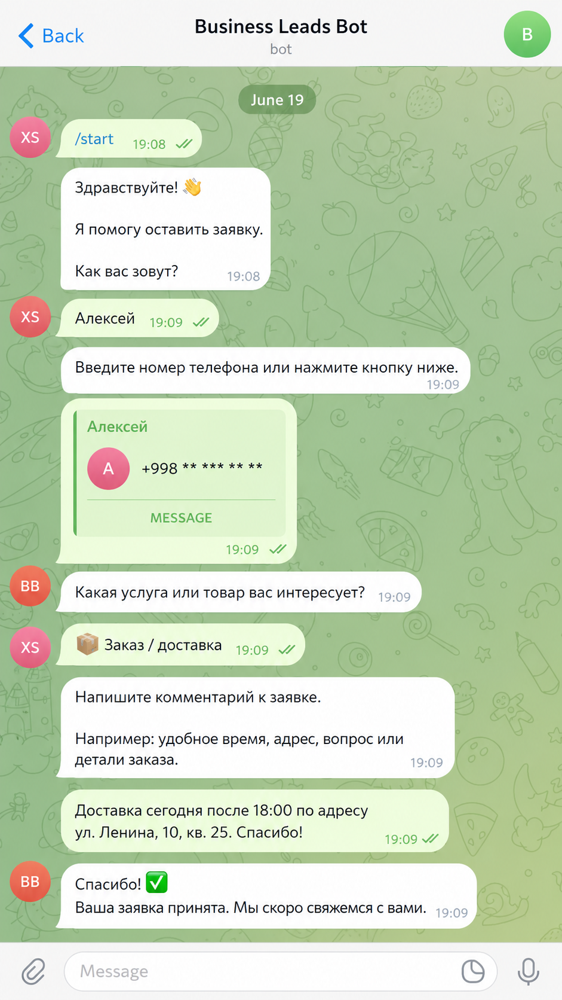
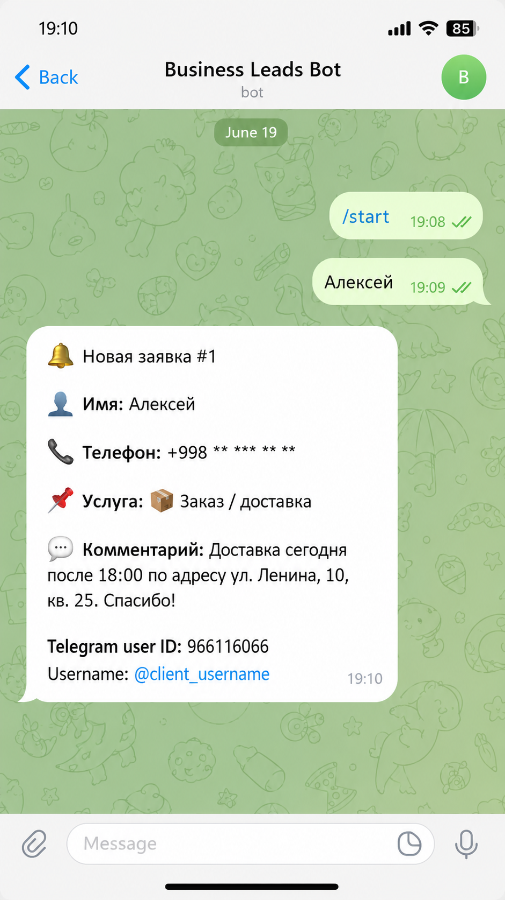

# Business Leads Telegram Bot

Telegram-бот для приема заявок от клиентов.

Проект подходит для кафе, учебных центров, клиник, магазинов и сервисных компаний.

## Что умеет бот

- Принимает заявку через Telegram
- Спрашивает имя клиента
- Спрашивает номер телефона
- Позволяет выбрать услугу или товар
- Принимает комментарий
- Сохраняет заявку в SQLite
- Отправляет уведомление администратору в Telegram

## Стек

- Python
- aiogram
- SQLite
- python-dotenv
- Telegram Bot API

## Как работает

Клиент нажимает `/start`.

Бот задает вопросы:

1. Имя
2. Телефон
3. Услуга / товар
4. Комментарий

После этого администратор получает уведомление о новой заявке.

## Установка

Создать виртуальное окружение:

```powershell
python -m venv .venv

## Скриншоты

### Диалог клиента с ботом



### Уведомление администратору

